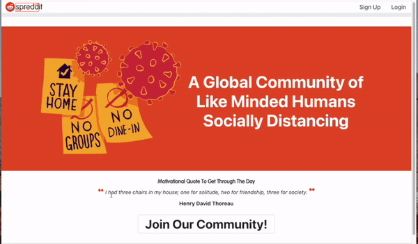
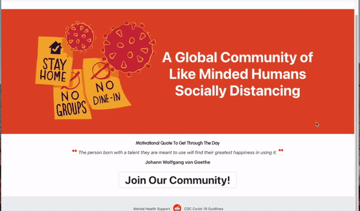
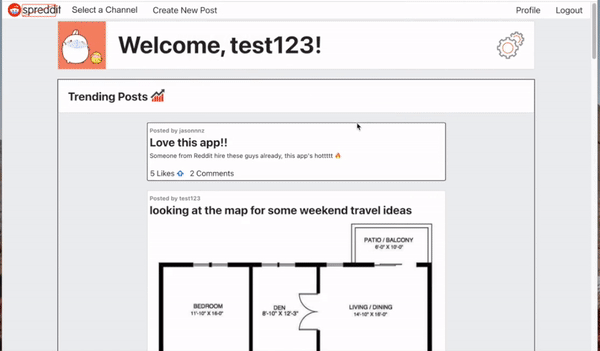
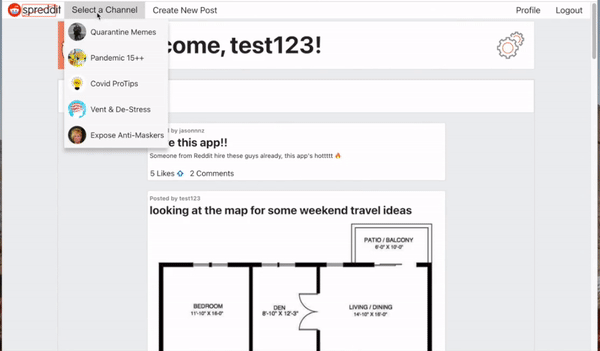
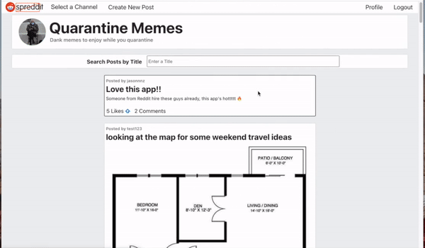
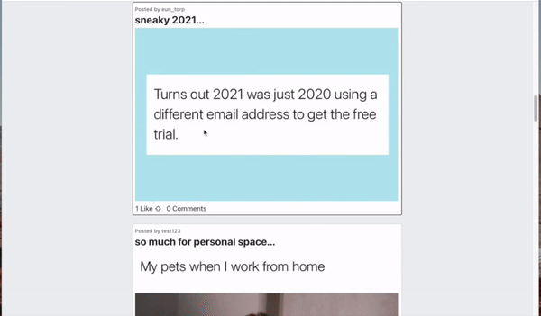
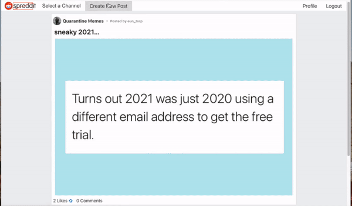
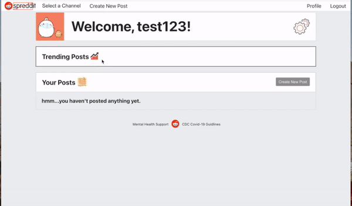
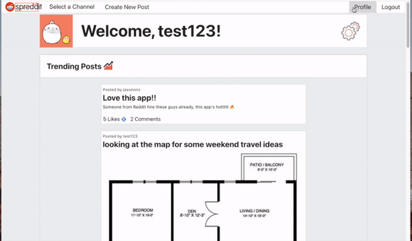

`Spreddit` is a web content and discussion application focused around pandemic related topics. Inspired by [Reddit](https://www.reddit.com/).

Requires [Spreddit front end](https://github.com/jeffreyc86/spreddit-frontend) and [Spreddit back end](https://github.com/jeffreyc86/spreddit-backend).

## Live Link & Demo

Visit the [Live Link](https://spreddit.netlify.app/) 

Watch the [Demo](https://www.loom.com/share/ee4777543eb6430098f9f0990072d761)

## Technologies Used

`Spreddit` is built with a `React` front end and `Ruby on Rails` and `PostgreSQL` back end. Styling is done with all custom CSS. The live link for `Spreddit` is deployed on [Netlify](https://www.netlify.com/) with [Heroku](https://www.heroku.com/) for the back end.

`Spreddit` relies on gifs and content posted by its users throughout the application.

## Features

`Spreddit` is a [Reddit](https://www.reddit.com/)-like clone highlighting topics related to the COVID-19 pandemic. Users are able to discover and make posts on various channels and interact with the `Spreddit` community.

### Home Page

On `Spreddit`'s home page, users are welcomed with an inspirational quote sourced from [Quotable](https://api.quotable.io/)'s API. The quote changes every time the page is rendered.

### User Authentication

Users are able to sign up and login. If any validations fail, errors are displayed back to the user. Upon a successful creation of an account or log in,  a `JWT Token` is issued to store the user's session and the user is brought to their profile page.

### User Profile

On their profile page, users will see the most recent posts within the trending posts section. They'll also see a section with all the posts they've created with like and comment statistics from the last 24 hours. 

Each post preview includes the option to like/unlike the post, as well as its current comment count. If the post was created by the user, there is the option to edit or delete the post.

### Channels

Posts are categorized based on the channel they're assigned when being created. To view a channel's posts, the user navigates to the `Select a Channel` tab and picks from the options - Quarantine Memes, Pandemic 15++, Covid ProTips, Vent & De-Stress, and Expose Anti-Maskers.

On a channel's page, users can view all the posts made within the channel. Posts are sorted by when they were created and can be searched for by title. Each post preview displays the current like and comment count, with the option to like/unlike the post.

### Posts

When a post preview is clicked on, the user is brought to the post's page. Here they'll again be able to like/unlike the post, but they'll also be able see all previous comments and leave their own comments. Comments can be posted anonymously, edited, and deleted.

### Creating Posts

Users create new posts by going through the prompts on the new post form. The only required field is the title field. Posts can be made anonymously. This option was specifically designed for the Vent & De-Stress channel where users share their struggles with the pandemic. There is also the option to upload an image file when creating/editing posts.

Once complete, the user is brought to the post's page where they'll be able to update and/or delete the post.

### Deleting Posts

Posts made by the user all have a button to delete the post. When deleted, all dependent likes and comments are also deleted. 

### Account Settings

Within the user's profile page, there is a hidden `Account Settings` area that appears when the gears are clicked. Within this section, the user may update their account information, as well as permanently delete their account.

### Logging Out

To end their session, users click on `Logout`. Once logged out, the stored `JWT Token` is deleted and they're brought back to the home page.

## License

The [MIT](https://choosealicense.com/licenses/mit/) License

Copyright (C) 2021 - [Jeffrey Chiu](https://jeffreychiu.dev/)